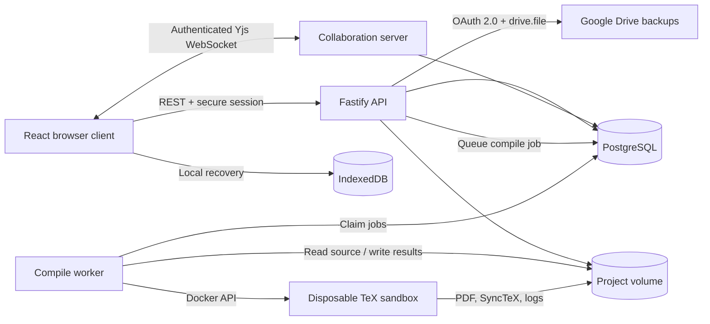

<p align="center">
  
</p>

<h1 align="center">TeXHarbor</h1>

<p align="center">
  A secure, self-hosted workspace for writing, compiling, and reviewing LaTeX together.
</p>

TeXHarbor combines a project dashboard, collaborative source editor, isolated LaTeX compilation, and continuous PDF preview in one responsive web application. Projects remain under the operator's control while authenticated collaborators can edit documents, discuss selected source, and review output in real time.

## Features

- Local accounts with secure, rolling server sessions
- Project creation, import, rename, duplication, trash, and recovery
- Nested folders, text sources, and binary project assets
- Overleaf-compatible ZIP import, including empty folders and EPS graphics
- Conflict-free collaborative editing with Yjs, presence, and remote selections
- IndexedDB recovery for local-first editing and reconnects
- Owner, editor, and viewer roles enforced by the API and WebSocket server
- Email-bound invitations with role changes and revocation
- Source-anchored comment threads, replies, and resolve/reopen workflows
- Asynchronous pdfLaTeX, XeLaTeX, and LuaLaTeX compilation
- Build logs, errors, warnings, continuous PDF viewing, and SyncTeX navigation
- Responsive Files, Source, and PDF workspaces for mobile screens
- Installable mobile web app with dedicated iOS, Android, and maskable icons
- Encrypted, content-aware Google Drive backups with history and safe restore
- Persistent light and dark themes with system-theme detection

## Architecture



The API is authoritative for identity, ownership, membership, invitations, comments, and project metadata. Yjs document updates are persisted in PostgreSQL, while project assets and build artifacts use a dedicated volume. Compilation happens outside the API process in short-lived containers with no network, no application secrets, and constrained resources.

## Technology

| Layer | Components |
| --- | --- |
| Web client | React, TypeScript, Vite, CodeMirror 6, PDF.js |
| Collaboration | Yjs, Hocuspocus, y-codemirror.next, IndexedDB |
| API | Node.js, Fastify, Zod, Argon2 |
| Persistence | PostgreSQL and Docker named volumes |
| Compilation | latexmk, TeX Live, Biber, Ghostscript, SyncTeX |
| Testing | Vitest and Playwright |

## Repository Layout

```text
apps/api/                 HTTP API, sessions, authorization, WebSocket server
apps/web/                 React dashboard and collaborative project workspace
apps/worker/              Asynchronous compilation worker
packages/contracts/       Shared schemas and API types
packages/database/        Database client and numbered migrations
docker/compiler/          Sandboxed compilation entrypoint
tests/e2e/                End-to-end browser workflows
```

## Quick Start

Requirements: Docker with Compose support and enough disk space for the TeX Live compiler image.

```bash
git clone git@github.com:MFrd1989/texharbor.git
cd texharbor
cp .env.example .env
```

Replace `POSTGRES_PASSWORD`, the matching password inside `DATABASE_URL`, and `SESSION_SECRET` in `.env`, then build and start the stack:

```bash
docker compose --profile build-only build compiler
docker compose build app worker
docker compose up -d app worker
docker compose ps
curl -f http://127.0.0.1:3000/api/health
```

TeXHarbor is available at `http://localhost:3000` by default. For an internet-facing deployment, place it behind HTTPS and set `PUBLIC_ORIGIN` to the exact public origin.

## Configuration

| Variable | Purpose |
| --- | --- |
| `DATABASE_URL` | PostgreSQL connection string used by the API and worker |
| `SESSION_SECRET` | Secret used to protect authentication and collaboration tokens |
| `PUBLIC_ORIGIN` | Canonical browser origin used for request-origin validation |
| `POSTGRES_VOLUME` | Durable PostgreSQL volume name |
| `PROJECT_VOLUME` | Durable project and build-artifact volume name |
| `COMPILER_IMAGE` | Sandboxed TeX image used by the worker |
| `GOOGLE_CLIENT_ID` | Optional Google OAuth web-application client ID for Drive backups |
| `GOOGLE_CLIENT_SECRET` | Optional server-only Google OAuth client secret |

For Drive backups, enable the Google Drive API and register `${PUBLIC_ORIGIN}/api/cloud/google/callback` as an authorized redirect URI. TeXHarbor requests only `drive.file`, encrypts refresh tokens at rest, and remains fully usable when Drive is not configured or connected.

See the complete [Google Drive backup setup and verification guide](docs/google-drive-backups.md) for Google Cloud Console, Docker deployment, testing, and troubleshooting steps.

Do not commit `.env`, reuse development secrets in production, or remove named volumes during an upgrade.

## Development and Testing

Node.js 22.13 or newer is required for local tooling.

```bash
npm install
npm run typecheck
npm test
npm run test:e2e
```

Database schema changes belong in numbered migrations under `packages/database/migrations`. Run the complete Docker build and browser workflow before submitting changes that affect authentication, collaboration, storage, or compilation.

## Security Model

Every private API and collaboration connection authenticates the user and checks project membership and role on the server. Paths and ZIP imports are validated before touching project storage. Compiler containers treat LaTeX as untrusted input: shell escape and networking are disabled, resources are limited, and application credentials are never mounted.

The worker requires Docker socket access to launch compiler sandboxes. Deploy it only on a controlled host and review this trust boundary for your environment.

## Roadmap

Planned vertical slices include a browsable activity log and version restoration UI, richer notifications, scheduled backup policies, and further source/PDF synchronization improvements.

Contributor conventions and verification expectations are documented in [AGENTS.md](AGENTS.md).
